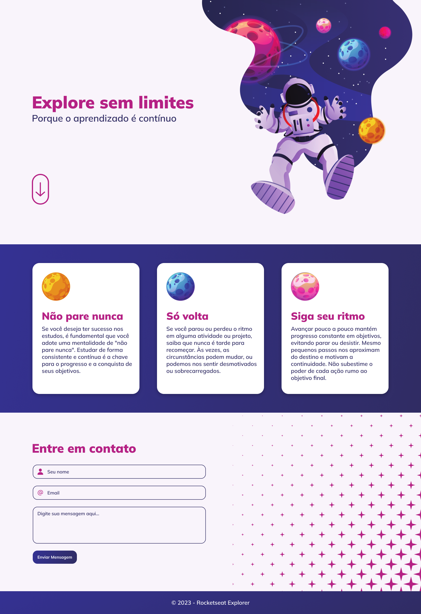

<h1 align="center"> Projeto Explore </h1>

Programa exclusivo e gratuito, promovido pela Rocketseat para ensino de tecnologias WEB.

  <a href="#-tecnologias">Tecnologias</a>&nbsp;&nbsp;&nbsp;|&nbsp;&nbsp;&nbsp;
  <a href="#-projeto">Projeto</a>&nbsp;&nbsp;&nbsp;|&nbsp;&nbsp;&nbsp;
  <a href="#-layout">Layout</a>&nbsp;&nbsp;&nbsp;|&nbsp;&nbsp;&nbsp;

  

 

## 🚀 Tecnologias

Esse projeto foi desenvolvido com as seguintes tecnologias:

- HTML e CSS
- Git e Github
- Figma

## 💻 Projeto

O Explore sem limites é um projeto proposto pelo bootcamp da Rocketseat,
para revisar os conceitos aprendidos na trilha Explorer.

Você pode visualizar o projeto através [DESSE LINK](https://gbenini.github.io/explore-project/) 👀

## 🔖 Layout

Você pode visualizar o layout do projeto através [DESSE LINK](https://www.figma.com/file/mN1O4uwamuQgqjsQ0YKjw0/Explore-sem-limites-(Copy)?type=design&node-id=158-677&mode=design&t=r10KQpPdmGy26NMC-0). É necessário ter conta no [Figma](https://figma.com) para acessá-lo.

Feito com ♥ by GBenini e Rocketseat :wave: [Participe da nossa comunidade!](https://discord.gg/rocketseat)